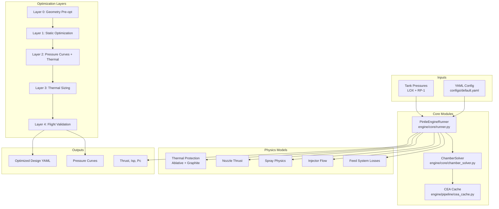

# Pintle Injector Liquid Rocket Engine Design Pipeline

A comprehensive physics-based simulation and **multi-layer optimization pipeline** for LOX/RP-1 pintle injector rocket engines. Takes tank pressures as input and solves for chamber pressure, mass flow rates, thrust, and all performance parameters.

## Overview

**Core Principle:** Chamber pressure (Pc) is **never** an input — it's always **solved** from tank pressures by balancing supply and demand.

**Key Capabilities:**
- Full flow path simulation: tank → feed system → injector → combustion → nozzle → thrust
- Multi-layer optimization for complete engine design (geometry, pressure curves, thermal protection)
- Time-varying analysis with ablative recession tracking
- Stability analysis (chugging, acoustic, feed-system coupling)
- Flight simulation validation via RocketPy integration

## Architecture



## Multi-Layer Optimization Pipeline

The optimizer in `engine/optimizer/` runs 5 layers sequentially:

| Layer | Name | Purpose | Key File |
|-------|------|---------|----------|
| 0 | Pre-Optimization | Coupled pintle + chamber geometry sizing | `CoupledPintleChamberOptimizer` |
| 1 | Static Optimization | Geometry + initial pressure curves, static hot-fire validation | `layers/layer1_static_optimization.py` |
| 2 | Burn Candidate | Time-series pressure curve optimization + thermal protection seeds | `layers/layer2_pressure.py`, `layers/layer2_burn_candidate.py` |
| 3 | Thermal Sizing | Final ablative/graphite thickness optimization | `layers/layer3_thermal_protection.py` |
| 4 | Flight Validation | RocketPy trajectory simulation, tank fill iteration | `layers/layer4_flight_simulation.py` |

### Entry Point

The main orchestrator is `run_full_engine_optimization_with_flight_sim()` in:
```
engine/optimizer/main_optimizer.py
```

## Directory Structure

```
EngineDesign/
├── engine/                      # Main engine package
│   ├── core/                    # Core physics models
│   │   ├── runner.py            # Main pipeline orchestrator
│   │   ├── chamber_solver.py    # Pc solver (supply = demand)
│   │   ├── chamber_geometry.py  # Chamber sizing calculations
│   │   ├── nozzle.py            # Thrust calculation
│   │   ├── spray.py             # Spray physics (J, SMD, Weber)
│   │   ├── discharge.py         # Dynamic Cd model
│   │   ├── geometry.py          # Injector geometry
│   │   └── injectors/           # Injector type implementations
│   │
│   ├── pipeline/                # Pipeline infrastructure
│   │   ├── config_schemas.py    # Pydantic validation
│   │   ├── cea_cache.py         # CEA thermochemistry caching
│   │   ├── io.py                # Config loading/saving
│   │   ├── time_varying_solver.py
│   │   ├── thermal/             # Thermal protection models
│   │   │   ├── ablative_cooling.py
│   │   │   ├── graphite_cooling.py
│   │   │   └── regen_cooling.py
│   │   └── stability/           # Stability analysis
│   │       ├── analysis.py
│   │       └── coupling.py
│   │
│   └── optimizer/               # Optimization layers
│       ├── main_optimizer.py    # Main orchestrator
│       ├── layers/              # Individual layer implementations
│       └── views/               # UI components for optimizer
│
├── ui/                          # Streamlit UI
│   ├── app.py                   # Main entry point
│   ├── flight_sim.py            # Flight simulation
│   └── flight_visuals.py        # Visualization helpers
│
├── copv/                        # COPV pressure calculations
│   ├── copv_solve.py
│   └── n2_Z_lookup.csv
│
├── configs/                     # Configuration files
│   └── default.yaml             # Base engine configuration
│
├── output/                      # Generated files (gitignored)
│   ├── logs/                    # Optimization logs
│   ├── plots/                   # Generated plots
│   └── cache/                   # CEA cache files
│
├── docs/                        # Documentation
│   ├── pipeline_status.md
│   └── quick_reference.md
│
├── scripts/                     # Utility scripts
│   ├── simple_example.py
│   └── run_full_pipeline.py
│
├── README.md
├── requirements.txt
└── .gitignore
```

## Quick Start

### Installation

```bash
pip install -r requirements.txt
```

**Dependencies:** numpy, scipy, pandas, matplotlib, pydantic, PyYAML, rocketcea, rocketpy, streamlit, plotly, ezdxf, cma

### Basic Usage

```python
from pathlib import Path
from engine.pipeline.io import load_config
from engine.core.runner import PintleEngineRunner

# Load configuration
config = load_config("configs/default.yaml")

# Initialize runner
runner = PintleEngineRunner(config)

# Evaluate at specific tank pressures
P_tank_O = 1305 * 6894.76  # psi to Pa
P_tank_F = 974 * 6894.76   # psi to Pa

results = runner.evaluate(P_tank_O, P_tank_F)

print(f"Thrust: {results['F']/1000:.2f} kN")
print(f"Chamber Pressure: {results['Pc']/6894.76:.1f} psi")
print(f"Mass Flow: {results['mdot_total']:.3f} kg/s")
print(f"Mixture Ratio: {results['MR']:.2f}")
```

### Run the UI

```bash
streamlit run ui/app.py
```

The Streamlit UI provides:
- Forward solver: Tank pressures → Performance
- Inverse solvers: Target thrust/O/F → Required tank pressures
- Full engine optimizer with multi-layer pipeline
- Time-series analysis and visualization
- Export optimized configurations

### Example Scripts

```bash
# Run full pipeline analysis
python scripts/run_full_pipeline.py

# Simple example
python scripts/simple_example.py

# Pressure sweep (2D grid)
python scripts/pressure_sweep.py
```

## Configuration

Engine parameters are defined in YAML. Key sections of `configs/default.yaml`:

```yaml
fluids:
  oxidizer: { name: LOX, density: 1140.0, ... }
  fuel: { name: RP-1, density: 780.0, ... }

injector:
  type: pintle
  geometry:
    lox: { n_orifices: 12, d_orifice: 0.003, ... }
    fuel: { d_pintle_tip: 0.015, h_gap: 0.0005, ... }

feed_system:
  oxidizer: { K0: 2.0, ... }
  fuel: { K0: 2.0, ... }

combustion:
  cea: { oxName: LOX, fuelName: RP-1, ... }
  efficiency: { ... }

chamber:
  A_throat: 0.0005
  Lstar: 1.0
  ...

nozzle:
  expansion_ratio: 4.0
  ...

ablative_cooling:
  enabled: true
  initial_thickness: 0.008
  ...

graphite_insert:
  enabled: true
  initial_thickness: 0.005
  ...
```

## Key Physics

### Chamber Solver
Root-finding: `supply(Pc) - demand(Pc) = 0`
- **Supply:** Mass flow from injectors (depends on P_tank - Pc)
- **Demand:** Mass flow required by combustion (depends on Pc, MR, c*)

### Discharge Coefficients
Dynamic model: `Cd(Re) = Cd_∞ - a_Re/√Re`

### Combustion Efficiency
L*-based: `η_c* = 1 - C × e^(-K×L*)`

### Nozzle Thrust
`F = ṁ × v_exit + (P_exit - P_ambient) × A_exit`

### Stability Analysis
- Chugging margin
- Acoustic modes
- Feed-system coupling
- Combined stability score (0-1)

## References

- Huzel & Huang: "Design of Liquid Propellant Rocket Engines"
- Sutton & Biblarz: "Rocket Propulsion Elements"
- Lefebvre: "Atomization and Sprays"

## Related Documentation

See the `docs/` folder for additional documentation:
- `docs/pipeline_status.md` - Detailed implementation status
- `docs/layer_requirements.md` - Layer interface requirements
- `docs/quick_reference.md` - Quick reference guide
