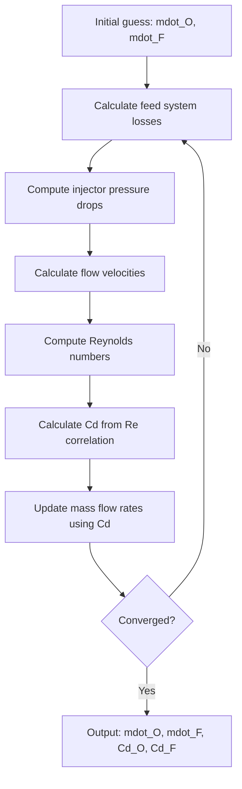

# Discharge Coefficient (Cd) Calculation Methodology

This document outlines how discharge coefficients (Cd) are calculated for LOX (oxidizer) and Fuel in the engine simulation.

---

## Overview

The discharge coefficient (Cd) represents the ratio of actual mass flow rate to the theoretical ideal mass flow rate through an orifice. It accounts for flow contraction, friction losses, and other non-ideal effects.

In this engine simulation, Cd values are computed **dynamically** as a function of Reynolds number, with optional corrections for pressure and temperature effects.

---

## Core Formula

The base discharge coefficient is calculated using a Reynolds-dependent correlation:

$$
C_d(Re) = C_{d,\infty} - \frac{a_{Re}}{\sqrt{Re}}
$$

Where:
- **Cd,∞** = Asymptotic discharge coefficient at high Reynolds number
- **a_Re** = Reynolds number correction parameter
- **Re** = Reynolds number at the orifice

The result is clamped to the range **[Cd_min, Cd_∞]** to prevent unphysical values.

---

## Reynolds Number Calculation

Reynolds number is computed from flow conditions:

$$
Re = \frac{\rho \cdot u \cdot d_{hyd}}{\mu}
$$

Where:
- **ρ** = Fluid density [kg/m³]
- **u** = Flow velocity at the orifice [m/s]
- **d_hyd** = Hydraulic diameter of the orifice [m]
- **μ** = Dynamic viscosity [Pa·s]

---

## Optional Corrections

### Pressure Correction (Compressibility Effects)

When enabled, accounts for compressibility at high pressures:

$$
C_d(P) = C_d(Re) \times \left[1 + a_P \cdot \left(\frac{P_{inlet}}{P_{ref}} - 1\right)\right]
$$

### Temperature Correction (Viscosity Effects)

When enabled, accounts for viscosity changes with temperature:

$$
C_d(T) = C_d(Re) \times \left[1 + a_T \cdot \left(\frac{T_{inlet}}{T_{ref}} - 1\right)\right]
$$

---

## Configuration Parameters

### LOX (Oxidizer) - Typical Values

| Parameter | Symbol | Default Value | Description |
|-----------|--------|---------------|-------------|
| Asymptotic Cd | Cd_inf | **0.40** | Cd at high Reynolds number |
| Re correction | a_Re | 0.15 | Reynolds correction parameter |
| Minimum Cd | Cd_min | 0.15 | Lower bound for Cd |
| Reference pressure | P_ref | 5.0 MPa | For pressure correction |
| Reference temperature | T_ref | 90 K | For temperature correction |

### Fuel - Typical Values

| Parameter | Symbol | Default Value | Description |
|-----------|--------|---------------|-------------|
| Asymptotic Cd | Cd_inf | **0.65** | Cd at high Reynolds number |
| Re correction | a_Re | 0.20 | Reynolds correction parameter |
| Minimum Cd | Cd_min | 0.20 | Lower bound for Cd |
| Reference pressure | P_ref | 5.0 MPa | For pressure correction |
| Reference temperature | T_ref | 300 K | For temperature correction |

> [!NOTE]
> The difference in Cd_inf between LOX (0.40) and Fuel (0.65) reflects the different injector geometries:
> - **LOX**: Flows through discrete orifices on the pintle tip (sharper edges, more flow restriction)
> - **Fuel**: Flows through an annular gap/reservoir (smoother flow path, less restriction)

---

## Iterative Solver Process

The Cd values are computed iteratively during the injector solve process:



### Key Steps:

1. **Initial Guess**: Start with estimated mass flow rates
2. **Feed Losses**: Calculate pressure drops through feed lines
3. **Injector ΔP**: Compute `P_injector - P_chamber`
4. **Velocity**: Calculate `u = mdot / (ρ × A)`
5. **Reynolds**: Compute `Re = (ρ × u × d_hyd) / μ`
6. **Cd Calculation**: Apply formula `Cd(Re) = Cd_∞ - a_Re/√Re`
7. **Mass Flow**: Update using `mdot = Cd × A × √(2ρΔP)`
8. **Iterate**: Repeat until converged

---

## Physical Basis

The Reynolds-dependent Cd model captures several physical phenomena:

| Re Regime | Cd Behavior | Physical Mechanism |
|-----------|-------------|-------------------|
| Low Re (< 1000) | Lower Cd | Viscous boundary layers thicken, blocking more flow area |
| High Re (> 10,000) | Approaches Cd_∞ | Thin boundary layers, flow approximates inviscid theory |
| Transitional | Interpolated | Smooth transition via 1/√Re term |

---

## Mass Flow Equation

The actual mass flow rate through the injector is:

$$
\dot{m} = C_d \cdot A \cdot \sqrt{2 \rho \Delta P_{inj}}
$$

Where:
- **A** = Physical orifice area [m²]
- **ΔP_inj** = Pressure drop across injector = P_injector - P_chamber [Pa]

---

## Cold-flow CdA mode (empirical)

When both `cda_fit_a` and `cda_fit_b` are set on `DischargeConfig` (from water cold-flow characterization or the experiment UI), the solver uses an **effective discharge area** that can depend on injector pressure drop, instead of `Cd(Re) × A`:

$$
(CdA)(\Delta P) = a \sqrt{\Delta P_{\mathrm{inj}}} + b \quad [m^2]
$$

Mass flow remains the incompressible orifice form with that effective area:

$$
\dot{m} = (CdA)(\Delta P_{\mathrm{inj}}) \cdot \sqrt{2 \rho \Delta P_{\mathrm{inj}}}
$$

**Physical intent:** Cold-flow rows give $CdA = \dot{m} / \sqrt{2 \rho_{\mathrm{water}} \Delta P}$ at each tested $\Delta P$. For hot fire, the same $(CdA)(\Delta P)$ is multiplied by $\sqrt{2 \rho_{\mathrm{propellant}} \Delta P}$ at the **live** $\Delta P_{\mathrm{inj}} = P_{\mathrm{inj}} - P_c$ each chamber iteration. That is the usual **constant effective area vs. fluid density** assumption: geometry and losses set $CdA$, and density enters only through the Bernoulli prefactor.

**Caveats:**

- The linear-in-$\sqrt{\Delta P}$ model for $CdA$ is a **regression choice**; it can absorb Reynolds-dependent trends from water data that will not match LOX/RP-1 Reynolds exactly. In fit mode, `Re` is not used inside `effective_cda()`.
- With the fit active, pintle (and related) injectors **do not** apply the spray-constrained `min(CdA, Cd_{\mathrm{eff}} \times A)$ cap** used in pure Reynolds mode, so the curve can exceed what the spray sub-model would otherwise cap.
- `Cd_O` / `Cd_F` reported in results are $CdA / A_{\mathrm{geom}}$ for diagnostics when a fit is used, not necessarily a classical single-fluid $C_d$.

**Time series and blowdown:** When “use cold-flow Cd” is toggled off in the API, a runner is built from a config copy with `cda_fit_*` cleared. Blowdown and pressure-fed tank integration use the **same** runner instance as the subsequent time-series evaluation so tank histories and chamber performance always share one discharge model.

---

## Source Files

The Cd calculation is implemented in:

| File | Purpose |
|------|---------|
| [`engine/core/discharge.py`](../engine/core/discharge.py) | `cd_from_re()`, `effective_cda()` (Re-based vs cold-flow fit) |
| [`engine/pipeline/config_schemas.py`](../engine/pipeline/config_schemas.py) | `DischargeConfig` schema definition |
| [`engine/core/injectors/pintle.py`](../engine/core/injectors/pintle.py) | Pintle injector integration |
| [`backend/routers/timeseries.py`](../backend/routers/timeseries.py) | `_runner_for_cd()` for time-series / blowdown toggle |
| [`configs/default.yaml`](../configs/default.yaml) | Default configuration values |

---

## Example Calculation

For a typical operating condition:

**LOX Side:**
```
ρ_O = 1140 kg/m³, μ_O = 0.00018 Pa·s
u_O = 30 m/s, d_hyd = 0.003 m

Re_O = (1140 × 30 × 0.003) / 0.00018 = 570,000

Cd_O = 0.40 - 0.15/√570000 = 0.40 - 0.0002 ≈ 0.40
```

**Fuel Side:**
```
ρ_F = 789 kg/m³, μ_F = 0.0012 Pa·s  
u_F = 20 m/s, d_hyd = 0.001 m

Re_F = (789 × 20 × 0.001) / 0.0012 = 13,150

Cd_F = 0.65 - 0.20/√13150 = 0.65 - 0.0017 ≈ 0.65
```

---

## Summary

| Propellant | Cd_∞ | Typical Operating Cd | Primary Dependency |
|------------|------|---------------------|-------------------|
| **LOX** | 0.40 | 0.35 - 0.40 | Reynolds number |
| **Fuel** | 0.65 | 0.60 - 0.65 | Reynolds number |

The lower Cd for LOX reflects its flow path through discrete sharp-edged orifices, while the higher Cd for fuel reflects the smoother annular gap geometry typical of pintle injector fuel delivery.
